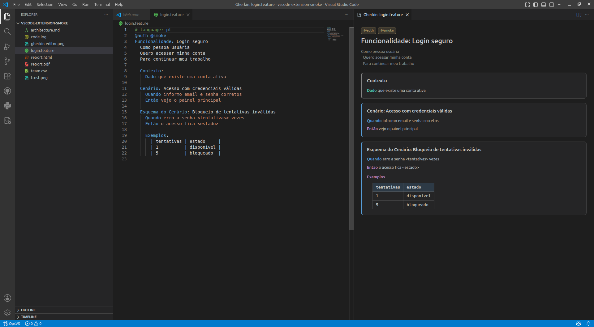

# Gherkin Preview

[](https://github.com/abreufilho/vscode-gherkin-preview/actions/workflows/ci.yml)
[](https://github.com/abreufilho/vscode-gherkin-preview/releases/latest)
[](LICENSE)

Read `.feature` files as formatted scenarios instead of plain text. The preview
parses Gherkin with the official Cucumber parser and renders each scenario as a
card, with tags, backgrounds, rules, data tables and examples laid out.

Parsing and rendering happen locally. The extension makes no network request and
collects no telemetry.



## Requirements

VS Code 1.80 or later.

## Installation

Download the `.vsix` from the [latest release](https://github.com/abreufilho/vscode-gherkin-preview/releases/latest)
and install it:

```bash
code --install-extension gherkin-preview-<version>.vsix
```

## Usage

Open a `.feature` file and run **Gherkin: Open Preview** from the Command
Palette, the editor title bar, or the Explorer context menu. The preview follows
the document as you type.

```gherkin
Feature: Checkout
  Scenario: Paying with a saved card
    Given a customer with a saved card
    When they confirm the order
    Then the payment is captured
```

## Features

- Renders scenarios, backgrounds, rules and scenario outlines as separate cards.
- Colours steps by keyword, in English and Portuguese.
- Lays out data tables and examples as tables.
- Shows parse errors in place, pointing at what the parser rejected.
- Ships syntax highlighting, snippets and language configuration for Gherkin.
- Follows the active VS Code light or dark theme.

## Commands

| Command | Availability |
| --- | --- |
| `Gherkin: Open Preview` | `.feature` files |

## Privacy

Parsing and rendering are local. The extension performs no network requests and
collects no telemetry.

## Contributing

Read [CONTRIBUTING.md](CONTRIBUTING.md) for the local setup and the checks that
run before a pull request. Participation follows the
[Code of Conduct](CODE_OF_CONDUCT.md). To report a vulnerability, see the
[security policy](SECURITY.md).

## Third-Party

The [Cucumber](https://github.com/cucumber/gherkin) parser is bundled under the
MIT license. Its copyright notice travels in the built bundle.

## License

[MIT](LICENSE) © [Antonio Abreu Filho](https://abreufilho.com.br)
